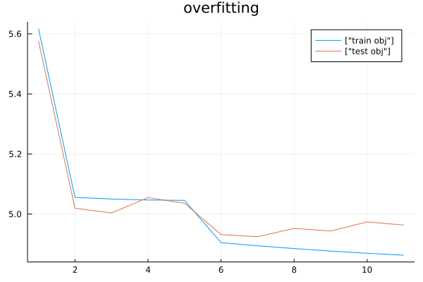

# Handle unrelated stopping criteria

In this tutorial, we present the use of Stopping to specify an "unrelated"
stopping criterion. A typical example is the so-called case of "overfitting", 
where the optimization process is actually designed to approximate another problem.

```
using ADNLPModels, LinearAlgebra, NLPModels, Plots, Printf, Random, Stopping
```

In this tutorial, we will use the classical steepest descent method with an Armijo line-search.

```
import Stopping.armijo
function armijo(xk, dk, fk, slope, f)
  t = 1.0
  fk_new = f(xk + dk)
  while f(xk + t * dk) > fk + 1.0e-4 * t * slope
    t /= 1.5
    fk_new = f(xk + t * dk)
  end
  return t, fk_new
end

function steepest_descent(stp :: NLPStopping)

  xk = stp.current_state.x
  fk, gk = objgrad(stp.pb, xk)

  OK = update_and_start!(stp, fx = fk, gx = gk)

  @printf "%2s %9s %7s %7s %7s\n" "k" "fk" "||∇f(x)||" "t" "λ"
  @printf "%2d %7.1e %7.1e\n" stp.meta.nb_of_stop fk norm(stp.current_state.current_score)
  while !OK
    dk = - gk
    slope = dot(dk, gk)
    t, fk = armijo(xk, dk, fk, slope, x->obj(stp.pb, x))
    xk += t * dk
    fk, gk = objgrad(stp.pb, xk)
    
    OK = update_and_stop!(stp, x = xk, fx = fk, gx = gk)

    @printf "%2d %9.2e %7.1e %7.1e %7.1e\n" stp.meta.nb_of_stop fk norm(stp.current_state.current_score) t slope
  end
  return stp
end
```

We also generate randomly some data.

```
Random.seed!(1234)
m, n = 50, 10
A  = rand(m, n)
b  = A * ones(n)
D  = vcat(A, A) + vcat(zeros(m,n), rand(m,n))
Db = vcat(b, b)
rperm = shuffle(1:2m)
Dr = D[rperm,:]
Dbr = Db[rperm,:]
```

We initialize two different problems evaluating respectively a training set, and a test set.

```
f(x, A, b, λ) = norm(A * x - b)^2 + λ * norm(x)^2
train_pb = ADNLPModel(x -> f(x, Dr[1:m,:], Dbr[1:m], 1e-2), zeros(n))
test_pb = ADNLPModel(x -> f(x, Dr[m+1:2m,:], Dbr[m+1:2m], 0.0), zeros(n))
```

In this tutorial, the motivation is to use the solver on the `test_pb`, and track the efficiency of the computed solution on the `train_pb`.
We specialize the stopping structure to store the objective function of both problems in the `stopping_user_struct`, and evaluate them in the `stp.meta.user_check_func!`.

```
train_check(stp, b) = begin 
  stp.stopping_user_struct[:test_obj][stp.meta.nb_of_stop+1] = obj(stp.stopping_user_struct[:test], stp.current_state.x)
  stp.stopping_user_struct[:train_obj][stp.meta.nb_of_stop+1] = obj(stp.pb, stp.current_state.x)
end
train_obj = NaN * ones(101)
test_obj  = NaN * ones(101)
train_stp = NLPStopping(train_pb, user_struct = Dict(:test => test_pb, :train_obj => train_obj, :test_obj => test_obj), user_check_func! = train_check, max_iter = 100)
```

We now run the steepest descent algorithm with the `train_stp` stopping.

```
steepest_descent(train_stp)
```

On the following plot in logarithmic scale, we can see that after a number of iterations, the progress made by the solver are no longer improving the other problem.

```
#hcat(log.(train_stp.stopping_user_struct[:train_obj]), log.(train_stp.stopping_user_struct[:test_obj]))
plot(log.(train_stp.stopping_user_struct[:train_obj]), label=["train obj"])
plot!(log.(train_stp.stopping_user_struct[:test_obj]), label=["test obj"], title="overfitting")
```


To overcome this issue, one possibility is to stop the solver when the second is no longer being minimized. The only modification is to set the entry `meta.stopbyuser` to `true`.

```
train_check_opt(stp, b) = begin 
  k = stp.meta.nb_of_stop
  stp.stopping_user_struct[:test_obj][k+1] = obj(stp.stopping_user_struct[:test], stp.current_state.x)
  stp.stopping_user_struct[:train_obj][k+1] = obj(stp.pb, stp.current_state.x)
  diff = k!=0 && stp.stopping_user_struct[:test_obj][k+1] - stp.stopping_user_struct[:train_obj][k+1] > 10
  inc  = k!=0 && stp.stopping_user_struct[:test_obj][k+1] > stp.stopping_user_struct[:test_obj][k]
  if diff && inc
    stp.meta.stopbyuser = true
  end
end
train_stp.meta.user_check_func! = train_check_opt
reset!(train_stp.pb)
reinit!(train_stp, rstate=true, x = zeros(10))
steepest_descent(train_stp)
```

```
nb_iter = train_stp.meta.nb_of_stop
hcat(log.(train_stp.stopping_user_struct[:train_obj][1:nb_iter+1]), log.(train_stp.stopping_user_struct[:test_obj][1:nb_iter+1]))
plot(log.(train_stp.stopping_user_struct[:train_obj][1:nb_iter+1]), label=["train obj"])
plot!(log.(train_stp.stopping_user_struct[:test_obj][1:nb_iter+1]), label=["test obj"], title="overfitting")
```


